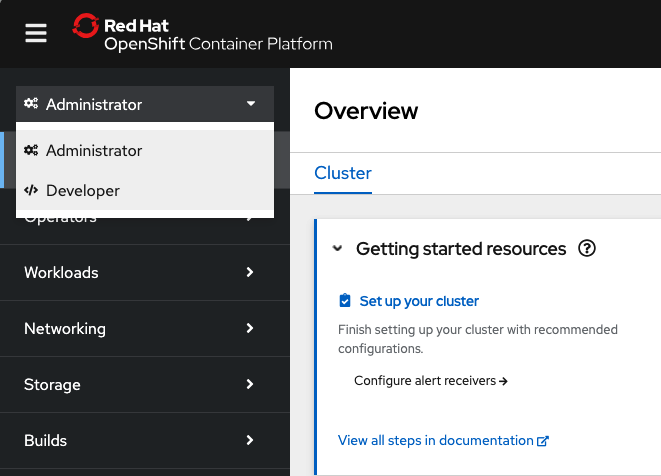
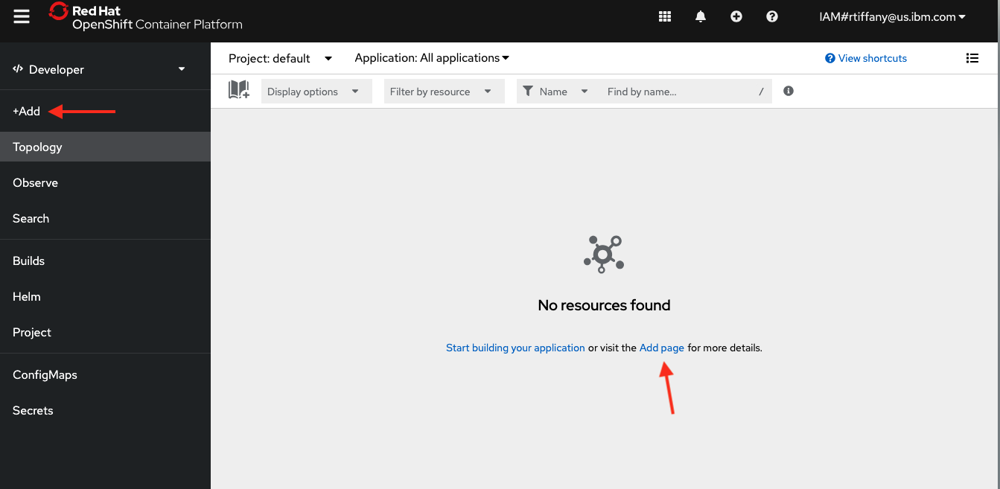

# Demo App Version 1

Follow this guide to deploy our first demo app to OpenShift. 

## Steps

### Accessing the OpenShift Console

- Navigate to the Clusters page [here](https://cloud.ibm.com/containers/cluster-management/clusters), click on the name of your deployed ROKS cluster to be taken to its overview page
- Click the 'OpenShift Web Console' button in the upper right of the page to initiate IAM > RBAC sign in process.
- Upon initial login you will most likely be in the Administrative view. In the upper left hand click on Administrator and select Developer to be taken to the developer dashboard

### Deploying the first demo app

You should end up on the `default` project dashboard. If not, select `default` from the project dropdown in the upper left hand corner of the page. Click on `Add` in the left hand navigation to start the app deployment process.

- Click the `Import from Git` option
    - Git Repo URL: https://github.com/cloud-design-dev/tech-lab-demos.git
	    - Expand `Show Advanced Git options`
		    - Git reference: No changes needed
			- Context dir: `/demo-app-v1`
			- Source Secret: No changes needed
	- Dockerfile build and deploy configuration
	    - General:
		    - Application name: `<group-name>-demo-apps`
			- Name: `demoapp1`
		- Build: No changes needed
		- Deploy: No changes needed
		- Advanced Options:
			- Target Port: Select `8080` from the dropdown
			- Expand Show advanced Routing options
			    - Ensure that Secure Route is selected, TLS Termination is set to Edge, and Insecure Traffic is set to Redirect
				- All other settings can be left as is 
		- Click Create to start the build and deploy of the demo app
	- You should be taken to the Topology view of the `default` project where you can see the build and deployment process
		- Under Build section, click `View Logs` to look at Build Logs
        - Once the build is complete, you should see a green check mark next to the build icon
		- Click back to Topology view
		    - Show Running pods
			- Click Route link to visit the demo app  
			- Test persistence (it should fail)
