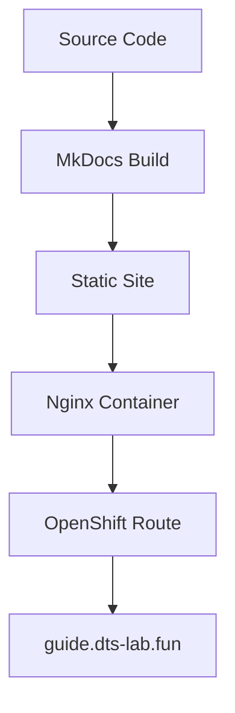

# MkDocs Documentation Site Deployment

This directory contains the necessary files to deploy the OpenShift Demo Lab documentation as a containerized MkDocs site on OpenShift.

## 🏗️ Architecture

The documentation site uses a multi-stage Docker build:

1. **Build Stage**: Uses Python to build static site with MkDocs
2. **Runtime Stage**: Serves static files with Nginx on port 8080
3. **OpenShift Integration**: Deployed with custom domain support



## 📁 File Structure

```
docs-site/
├── Dockerfile              # Multi-stage build configuration
├── nginx.conf              # Nginx configuration for OpenShift
├── openshift/
│   ├── mkdocs-site.yaml    # OpenShift deployment manifests
│   └── deploy.sh           # Automated deployment script
└── README.md               # This file
```

## 🚀 Deployment Options

### Method 1: Automated Deployment (Recommended)

```bash
# Deploy to OpenShift with custom domain
mise run docs-deploy-openshift
```

### Method 2: Manual Deployment

```bash
cd docs-site/openshift/
./deploy.sh
```

### Method 3: Step-by-Step

```bash
# Apply OpenShift manifests
oc apply -f docs-site/openshift/mkdocs-site.yaml

# Start the build
oc start-build mkdocs-site --wait

# Wait for deployment
oc rollout status deployment/mkdocs-site
```

## 🧪 Local Testing

### Test Docker Build Locally

```bash
# Build the container image
mise run docs-docker-build

# Run locally (available at http://localhost:8080)
mise run docs-docker-run

# Stop when done
mise run docs-docker-stop
```

### Test with MkDocs Dev Server

```bash
# Install dependencies
mise run docs-install

# Serve with live reload (available at http://127.0.0.1:8001)
mise run docs-dev
```

## 🌐 Custom Domain Configuration

The site is configured to use **guide.dts-lab.fun**:

### OpenShift Route
```yaml
spec:
  host: guide.dts-lab.fun
  tls:
    termination: edge
    insecureEdgeTerminationPolicy: Redirect
```

### MkDocs Configuration
```yaml
site_url: https://guide.dts-lab.fun
```

### DNS Configuration
Ensure your DNS has a CNAME record pointing to the OpenShift router:
```
guide.dts-lab.fun CNAME your-openshift-router.domain.com
```

## 📊 Resource Configuration

The deployment includes:

### Container Resources
- **CPU Request**: 50m (0.05 cores)
- **CPU Limit**: 100m (0.1 cores)  
- **Memory Request**: 64Mi
- **Memory Limit**: 128Mi

### Scaling Configuration
- **Replicas**: 2 (for high availability)
- **Rolling Update**: 25% max unavailable/surge

### Health Checks
- **Liveness Probe**: `/health` endpoint
- **Readiness Probe**: `/health` endpoint
- **Custom Health Endpoint**: Returns "healthy" status

## 🔍 Monitoring and Troubleshooting

### Check Deployment Status
```bash
# View pods
oc get pods -l app=mkdocs-site

# Check deployment
oc get deployment mkdocs-site

# View route
oc get route mkdocs-site-route
```

### View Logs
```bash
# Application logs
oc logs deployment/mkdocs-site -f

# Build logs
oc logs bc/mkdocs-site -f
```

### Debug Issues
```bash
# Describe problematic pods
oc describe pod -l app=mkdocs-site

# Check events
oc get events --sort-by=.metadata.creationTimestamp

# Test health endpoint
curl https://guide.dts-lab.fun/health
```

## 🔄 Updates and Rebuilds

### Automatic Updates
The deployment includes automatic triggers:
- **Config Changes**: Rebuilds when BuildConfig changes
- **Image Changes**: Redeploys when new images are available

### Manual Updates
```bash
# Trigger new build
oc start-build mkdocs-site

# Force deployment rollout
oc rollout restart deployment/mkdocs-site
```

## 🛡️ Security Configuration

### Container Security
- **Non-root user**: Runs as nginx user (UID 101)
- **Security context**: Drops all capabilities
- **Read-only filesystem**: Except for required nginx directories

### Network Security
- **HTTPS only**: TLS edge termination with redirect
- **Security headers**: XSS protection, content type sniffing prevention
- **Content Security Policy**: Restricts resource loading

## 📈 Performance Optimizations

### Nginx Configuration
- **Gzip compression**: Enabled for text content
- **Static asset caching**: 1 year cache for images/CSS/JS
- **Efficient serving**: Direct file serving with fallbacks

### OpenShift Optimizations
- **Multi-replica**: 2 pods for load distribution
- **Resource limits**: Right-sized for documentation workload
- **Health checks**: Fast failure detection and recovery

## 🎯 Expected Outcomes

After successful deployment:

✅ **Site accessible** at https://guide.dts-lab.fun  
✅ **HTTPS enabled** with automatic redirect from HTTP  
✅ **High availability** with 2 replicas  
✅ **Health monitoring** with probes  
✅ **Search functionality** works across all content  
✅ **Mobile responsive** design  
✅ **Dark/light theme** toggle functional  

The documentation site will serve as a unified resource for lab participants, eliminating the need to bounce between GitHub READMEs and the OpenShift console.