# Demo Applications Architecture

The OpenShift Demo Lab includes four progressively complex applications, each designed to demonstrate specific container orchestration concepts. This page provides a comprehensive architectural overview of all demo applications.

## 🏗️ Overall Architecture


## 📊 Application Comparison Matrix

| Component | V1 (Ephemeral) | V2 (Persistent) | V3 (Scaling) | V4 (Health) |
|-----------|----------------|-----------------|--------------|-------------|
| **Storage** | In-Memory | PostgreSQL | PostgreSQL | PostgreSQL |
| **Persistence** | ❌ None | ✅ Survives restarts | ✅ Survives restarts | ✅ Survives restarts |
| **Scaling** | Manual only | Manual only | ✅ Auto (HPA) | Manual/Auto |
| **Health Probes** | ❌ None | ❌ Basic | ✅ Basic | 🔧 **Configurable** |
| **Resource Limits** | Basic | Enhanced | ✅ **Optimized for scaling** | Production-ready |
| **Load Testing** | Basic | Basic | ✅ **HPA triggers** | Basic |
| **Step Focus** | Storage limitations | Database integration | Resource management | Health monitoring |

## 🔄 Progressive Learning Path

Each application builds upon the previous one:


## 🧩 Common Components

All demo applications share several architectural patterns:

### Container Image Strategy
- **Base Image:** Red Hat UBI 8 Python 3.9
- **Build Method:** Source-to-Image (S2I)
- **Registry:** OpenShift internal registry
- **Security:** Non-root user, minimal attack surface

### Networking Pattern


### Resource Management
- **CPU Requests:** 100m (0.1 cores)
- **CPU Limits:** 500m (0.5 cores) 
- **Memory Requests:** 128Mi
- **Memory Limits:** 256Mi (V1/V2) or tuned for scaling (V3/V4)

## 🎯 Application-Specific Architecture

### Demo App V1: Ephemeral Storage

**Purpose:** Demonstrate storage limitations in containerized applications

```mermaid
graph TD
    Request[HTTP Request] --> Route[OpenShift Route]
    Route --> Service[ClusterIP Service]
    Service --> Pod[Flask Pod]
    Pod --> App[Flask Application]
    App --> Memory[In-Memory Dict]
    App --> Metrics[Resource Monitoring]
    
    Memory -.->|Data Lost on Restart| X[💀]
    
    style Memory fill:#ffcdd2
    style Metrics fill:#e8f5e8
```



**Key Features:**
- **Ephemeral Storage:** All data stored in Python dictionaries
- **Data Loss Demonstration:** Page reload triggers data reset
- **Resource Monitoring:** Real-time CPU/memory metrics
- **API Endpoints:** Health, status, metrics, persistence testing

### Demo App V2: Persistent Storage

**Purpose:** Solve persistence problems with database integration


**Key Features:**
- **Database Persistence:** PostgreSQL with SQLAlchemy ORM
- **Persistent Volume:** 20GB IBM Cloud Block Storage
- **Data Survival:** Survives pod restarts, scaling, updates
- **Fallback Support:** SQLite for local development

### Demo App V3: Resource Management & Auto-Scaling

**Purpose:** Demonstrate resource management and horizontal autoscaling


**Key Features:**
- **Horizontal Pod Autoscaler:** CPU and memory-based scaling
- **Resource Optimization:** Aggressive limits to trigger scaling
- **Load Testing:** Built-in endpoints to generate load
- **Shared Database:** All pods connect to same PostgreSQL instance

### Demo App V4: Health Probes & Production Readiness

**Purpose:** Implement production health monitoring and self-healing


**Key Features:**
- **Three Probe Types:** Liveness, readiness, and startup probes
- **Step 6 Workflow:** Automatic completion when all probes configured
- **Self-Healing:** Automatic restart of unhealthy containers
- **Production Patterns:** Real-world health monitoring implementation

## 🔧 Technical Implementation Details

### Language and Framework Stack
```python
# Common stack across all applications
- Python 3.12
- Flask web framework
- SQLAlchemy ORM (V2-V4)
- psutil for system monitoring
- psycopg2 for PostgreSQL connectivity (V2-V4)
```

### Database Schema (V2-V4)
```sql
-- Shared schema across persistent applications
CREATE TABLE entries (
    id SERIAL PRIMARY KEY,
    data TEXT,
    timestamp TIMESTAMP DEFAULT NOW()
);

CREATE TABLE status (
    id SERIAL PRIMARY KEY,
    key VARCHAR(50),
    value TEXT,
    updated_at TIMESTAMP DEFAULT NOW()
);
```

### Environment Configuration
```bash
# Common environment variables
PORT=8080                    # Application port
ENVIRONMENT=production       # Deployment environment

# Database configuration (V2-V4)
DATABASE_URL=postgresql://...
POSTGRES_HOST=postgresql-service
POSTGRES_PORT=5432
POSTGRES_USER=demo_user
POSTGRES_PASSWORD=[secret]
POSTGRES_DB=demo_db
```

## 📈 Scalability Patterns

### Vertical Scaling (Resource Limits)
```yaml
resources:
  requests:
    memory: "128Mi"
    cpu: "100m"
  limits:
    memory: "256Mi"    # V1/V2: Standard
             "512Mi"    # V3: Optimized for scaling
    cpu: "500m"
```

### Horizontal Scaling (V3 Focus)
```yaml
# Horizontal Pod Autoscaler configuration
spec:
  minReplicas: 2
  maxReplicas: 10
  targetCPUUtilizationPercentage: 70
  targetMemoryUtilizationPercentage: 80
```

## 🔍 Monitoring and Observability

### Application Metrics
All applications expose consistent metrics:

| Endpoint | Purpose | Data |
|----------|---------|------|
| `/api/health` | Health checks | Application status |
| `/api/status` | Application state | Version, uptime, config |
| `/api/metrics` | Resource monitoring | CPU, memory, network |
| `/api/persistence/stats` | Storage info | Data counts, storage type |

### OpenShift Integration
- **Built-in Monitoring:** Prometheus metrics collection
- **Resource Dashboards:** CPU, memory, network graphs
- **Log Aggregation:** Container logs via OpenShift logging
- **Event Tracking:** Kubernetes events for troubleshooting

## 🎓 Educational Value

Each application teaches specific concepts:

### V1 - Container Fundamentals
- Understanding container lifecycle
- Recognizing ephemeral storage limitations  
- Basic resource monitoring
- S2I build process

### V2 - Data Persistence
- Database integration patterns
- Persistent Volume Claims
- Connection management
- Data migration strategies

### V3 - Production Scaling
- Resource limit optimization
- Horizontal scaling triggers
- Load testing techniques
- Performance monitoring

### V4 - Production Readiness
- Health probe configuration
- Self-healing container patterns
- Production monitoring setup
- Troubleshooting workflows

This architectural progression ensures that participants gain comprehensive understanding of container orchestration, from basic concepts through production-ready deployments.

---

*The demo applications represent real-world patterns used in enterprise OpenShift deployments, providing practical skills that translate directly to production environments.* 🎯