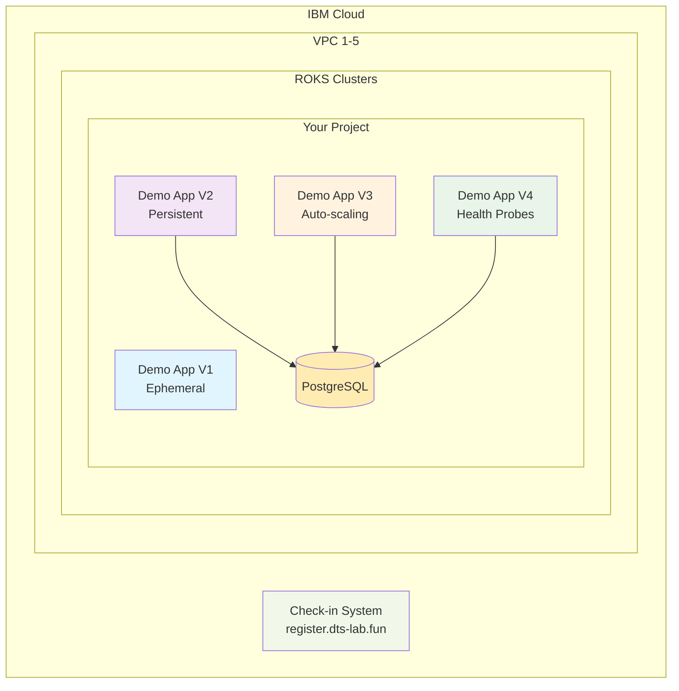

# Lab Overview

Welcome to the OpenShift Demo Lab! This comprehensive hands-on learning experience is designed to take you from basic container concepts to production-ready OpenShift deployments.

## 🎯 What You'll Accomplish

By the end of this lab, you'll have deployed and managed multiple applications demonstrating key OpenShift and Kubernetes concepts:

- **Containerized Applications** running on enterprise Kubernetes
- **Persistent Storage** solutions for stateful applications
- **Resource Management** with CPU and memory limits
- **Horizontal Scaling** with automatic pod autoscaling
- **Health Monitoring** with probes and self-healing capabilities

## 🏗️ Lab Architecture

The lab environment consists of:

### Infrastructure Layer
- **IBM Cloud VPC** - Virtual Private Cloud for network isolation
- **Red Hat OpenShift on IBM Cloud (ROKS)** - Managed Kubernetes platform
- **IBM Cloud Block Storage** - Persistent storage for databases
- **IBM Secrets Manager** - Certificate and secret management

### Application Layer
- **Demo Applications V1-V4** - Progressive learning applications
- **PostgreSQL Databases** - Persistent data storage
- **Check-in Registration System** - Lab participant management

## 📚 Learning Path

The lab follows a carefully structured progression:

### Phase 1: Foundation (Steps 1-2)
- **Deploy ROKS Cluster** - Understand OpenShift architecture
- **Explore Console** - Master the OpenShift web interface

### Phase 2: Basic Applications (Step 3)
- **Demo App V1** - Learn ephemeral storage limitations
- **Containerization** - Understand S2I builds and deployments

### Phase 3: Persistent Storage (Step 4)
- **Demo App V2** - Implement database persistence
- **Data Survival** - See how persistent storage solves real problems

### Phase 4: Production Concepts (Steps 5-6)
- **Demo App V3** - Master resource limits and autoscaling
- **Demo App V4** - Implement health probes and monitoring

## 🎓 Key Learning Concepts

### Container Orchestration
- **Pod Lifecycle Management** - How containers start, run, and restart
- **Service Discovery** - How applications find and communicate with each other
- **Load Balancing** - How traffic is distributed across multiple pods
- **Rolling Deployments** - How to update applications without downtime

### Storage Management
- **Ephemeral vs Persistent** - Understanding different storage types
- **Volume Mounts** - How containers access external storage
- **Database Integration** - Connecting applications to persistent data stores
- **Backup and Recovery** - Protecting critical application data

### Resource Management
- **CPU and Memory Limits** - Preventing applications from consuming too many resources
- **Horizontal Pod Autoscaling** - Automatically scaling based on load
- **Resource Monitoring** - Understanding application performance metrics
- **Cost Optimization** - Right-sizing resources for efficiency

### Production Readiness
- **Health Probes** - Monitoring application health and enabling self-healing
- **Security Practices** - Implementing proper authentication and authorization
- **Monitoring and Alerting** - Setting up production monitoring systems
- **Troubleshooting** - Diagnosing and resolving common issues

## 👥 Lab Structure

### Group Organization
- **25 Groups Total** - Groups A through Y
- **3 Participants per Group** - Collaborative learning environment
- **5 VPCs** - 5 groups per VPC for resource organization
- **Dedicated Resources** - Each group has isolated OpenShift clusters and services

## ⏱️ Time Estimates

| Session | Estimated Time | Activities |
|---------|----------------|------------|
| **Setup** | 30 minutes | Registration, prerequisites, cluster deployment |
| **Session 1-2** | 45 minutes | Console tour, basic concepts |
| **Session 3** | 30 minutes | Deploy V1, understand ephemeral storage |
| **Session 4** | 45 minutes | Deploy V2, implement persistence |
| **Session 5** | 30 minutes | Deploy V3, configure autoscaling |
| **Session 6** | 30 minutes | Deploy V4, health monitoring |
| **Wrap-up** | 15 minutes | Review, cleanup, next steps |

**Total Lab Time:** ~3.5 hours

## 🛠️ Technology Stack

### Platform Components
- **Red Hat OpenShift 4.x** - Enterprise Kubernetes platform
- **IBM Cloud VPC** - Virtual private cloud infrastructure
- **IBM Cloud Block Storage** - High-performance persistent storage

### Application Technologies
- **Python 3.12** - Application runtime
- **Flask** - Web application framework
- **PostgreSQL 15** - Relational database
- **SQLAlchemy** - Database ORM
- **IBM Cloud SDK** - Cloud service integration

### DevOps Tools
- **Source-to-Image (S2I)** - Container build system
- **OpenShift Routes** - External traffic routing
- **Horizontal Pod Autoscaler** - Automatic scaling
- **Prometheus** - Metrics collection (built into OpenShift)

## 📋 Success Criteria

You'll know you've successfully completed the lab when you can:

- ✅ **Deploy applications** from Git repositories using OpenShift
- ✅ **Explain the difference** between ephemeral and persistent storage
- ✅ **Configure resource limits** and understand their impact
- ✅ **Set up autoscaling** that responds to application load
- ✅ **Implement health probes** for production readiness
- ✅ **Troubleshoot common issues** using OpenShift tools
- ✅ **Understand** when and how to use different OpenShift features

## 🆘 Support Resources

Throughout the lab, you have access to:

- **Lab Instructors** - Expert guidance and troubleshooting help
- **Documentation** - This comprehensive guide and OpenShift docs
- **Fellow Participants** - Collaborative learning and peer support
- **Hands-on Environment** - Real infrastructure for practical experience

## 🚀 Ready to Begin?

The lab is designed to be self-paced with guided instruction. Each step builds upon the previous one, so it's important to complete them in order.

**Next Steps:**

1. [Review Prerequisites](prerequisites.md) - Ensure you have everything needed
2. [Start the Lab Sessions](../lab-sessions/overview.md) - Begin your OpenShift journey!

---

*This lab represents real-world OpenShift deployment patterns used by enterprise customers. The skills you learn here apply directly to production environments.* 🎯