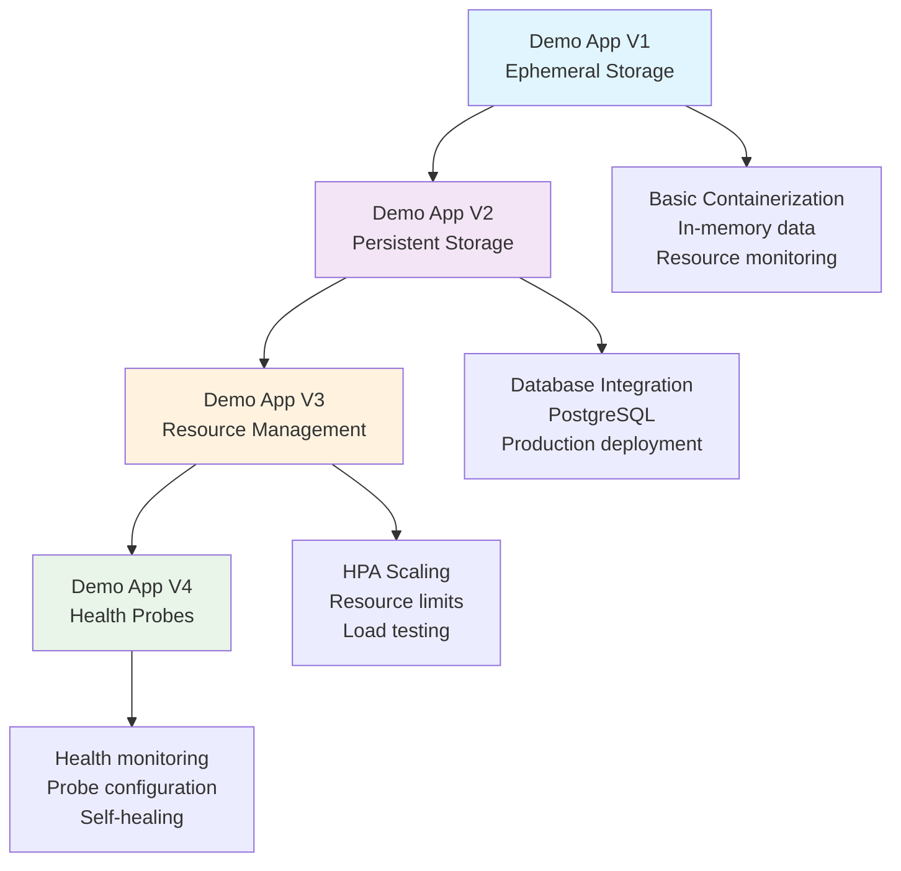

# OpenShift Demo Lab

Welcome to the comprehensive OpenShift Demo Lab! This hands-on learning platform is designed to take you through the essential concepts of container orchestration, from basic containerization to production-ready deployments.

## 🎯 What You'll Learn

This lab provides practical experience with:

- **Container Fundamentals** - Understanding containerization and basic deployment patterns
- **Storage Management** - Ephemeral vs persistent storage in containerized environments  
- **Resource Management** - CPU and memory limits, horizontal autoscaling
- **Health Monitoring** - Application lifecycle management and health probes
- **Production Deployment** - Real-world OpenShift deployment patterns

## 🚀 Lab Progression

The lab follows a progressive approach with increasingly sophisticated concepts:

-   :material-database-off:{ .lg .middle } **Demo App V1**

    ---

    Learn about **ephemeral storage** limitations and basic container deployment patterns.

    [:octicons-arrow-right-24: Start with V1](demo-apps/v1-ephemeral.md)

-   :material-database:{ .lg .middle } **Demo App V2**

    ---

    Implement **persistent storage** with database backends and production deployment patterns.

    [:octicons-arrow-right-24: Continue to V2](demo-apps/v2-persistent.md)

-   :material-chart-line:{ .lg .middle } **Demo App V3**

    ---

    Master **resource management** and horizontal pod autoscaling with CLI operations.

    [:octicons-arrow-right-24: Progress to V3](demo-apps/v3-resources.md)

-   :material-heart-pulse:{ .lg .middle } **Demo App V4**

    ---

    Complete the journey with **health probe** configuration and production readiness.

    [:octicons-arrow-right-24: Finish with V4](demo-apps/v4-health-probes.md)

## 🏗️ Architecture Overview

Each demo application builds upon the previous version, introducing new concepts while maintaining consistency in the learning experience:

## 📋 Prerequisites

Before starting the lab, ensure you have:

- ✅ IBM Cloud account with appropriate permissions
- ✅ Group assignment and VPC resources (provided during lab setup)
- ✅ Basic familiarity with containers and Kubernetes concepts
- ✅ OpenShift CLI (`oc`) installed (optional if you want to run commands locally vs Cloud Shell) 

!!! tip "Don't have the ibmcloud cli, kubectl or oc installed? "
    Don't worry you can use [Cloud Shell](https://cloud.ibm.com/shell) which includes all the tools you need for the lab

## 🎓 Learning Outcomes

By the end of this lab, you'll have hands-on experience with:

### Container Fundamentals
- Understanding container lifecycle management
- Configuring resource requests and limits
- Managing environment variables and configuration
- Working with multi-stage Docker builds

### Storage and Persistence
- Recognizing ephemeral storage limitations
- Implementing Persistent Volume Claims (PVC)
- Integrating database backends
- Understanding StatefulSet vs Deployment patterns

### Networking and Services
- Service discovery and internal DNS
- Route configuration with TLS termination
- Load balancing across multiple pods
- Health check integration

### Scaling and Performance
- Manual scaling operations
- Horizontal Pod Autoscaler (HPA) configuration
- Resource utilization monitoring
- Load testing and traffic generation

### Production Readiness
- Health probe configuration (liveness, readiness, startup)
- Rolling deployment strategies
- Application lifecycle management
- Monitoring and troubleshooting techniques

## 🚀 Quick Start

Ready to begin? Here are your next steps:

1. **[Register for the Lab](getting-started/registration.md)** - Get your group assignment and VPC resources
2. **[Review Prerequisites](getting-started/prerequisites.md)** - Ensure you have everything needed
3. **[Start Session 1](lab-sessions/step-1-roks-cluster.md)** - Deploy your first ROKS cluster

## 💡 Lab Structure

This documentation is organized into several key sections:

- **Getting Started** - Initial setup and registration
- **Lab Sessions** - Step-by-step guided sessions
- **Demo Applications** - Detailed application documentation
- **Deployment Guides** - Comprehensive deployment instructions
- **Reference** - Commands, troubleshooting, and API documentation

Navigate using the menu above or use the search function to find specific topics.

## 🆘 Need Help?

If you encounter issues during the lab:

1. Check the [Troubleshooting Guide](reference/troubleshooting.md)
2. Review the [OpenShift Commands Reference](reference/openshift-commands.md)
3. Ask your lab instructor or fellow participants
4. Submit issues on the [GitHub repository](https://github.com/cloud-design-dev/tech-lab-demos/issues)

---

*Ready to dive into OpenShift? Let's get started!* 🎉
