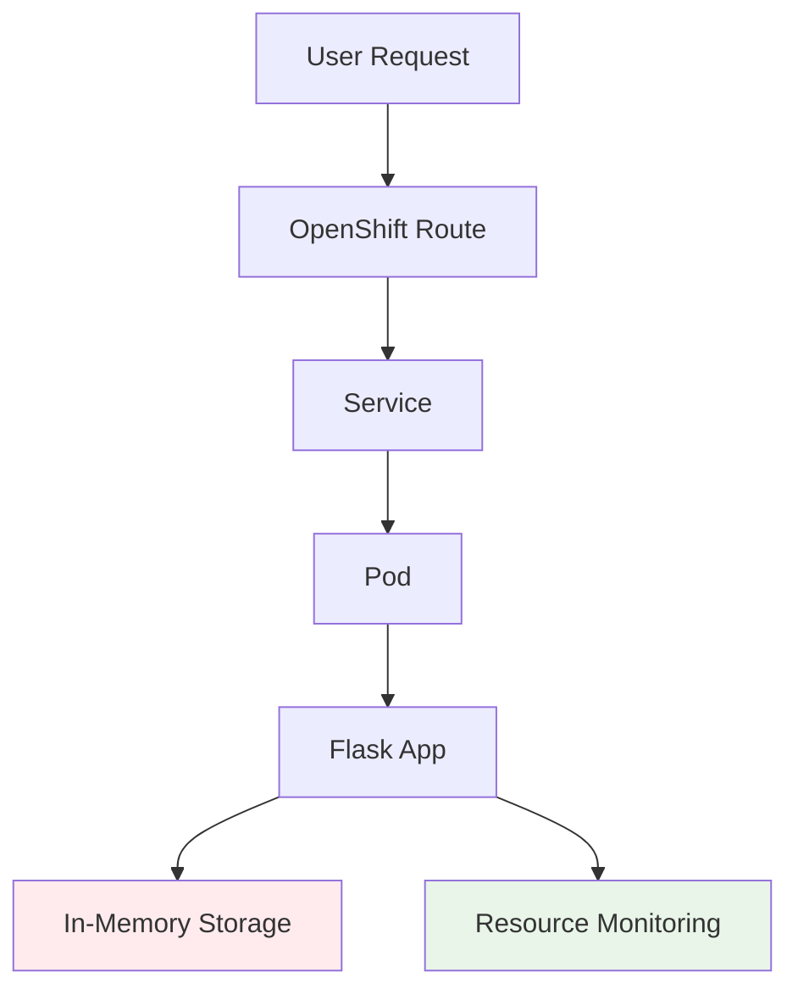

# Step 3: Deploy Demo App V1 (Ephemeral Storage)

In this session, you'll deploy your first demo application to OpenShift, learning about ephemeral storage patterns and basic containerization concepts.

!!! info "Estimated Time"
    **Setup Time:** 15-20 minutes  
    **Learning Time:** 10-15 minutes

## 🎯 Learning Objectives

By the end of this step, you will:

- ✅ Deploy applications using OpenShift's "Import from Git" feature
- ✅ Understand Source-to-Image (S2I) build processes
- ✅ Explore ephemeral storage characteristics and limitations
- ✅ Monitor real-time container resource usage
- ✅ Demonstrate data persistence challenges in containerized apps

## 📋 Prerequisites

Before starting this step:

- [ ] Completed [Step 1: ROKS Cluster](step-1-roks-cluster.md) and [Step 2: Console Tour](step-2-console-tour.md)
- [ ] Have an active OpenShift project (created in Step 2)
- [ ] Access to OpenShift Developer console

## 🏗️ Demo App V1 Overview

**Demo App V1** demonstrates **ephemeral storage** patterns in containerized applications:

### Key Features
- 📊 **Real-time metrics** showing CPU and memory usage vs container limits
- 🔄 **In-memory data storage** that resets on container restart
- 📈 **Resource monitoring** with container-aware detection
- 🔍 **API endpoints** for testing persistence behavior
- ⚡ **Step progress visualization** showing current lab progress

### Architecture


## 🚀 Deployment Instructions

### 1. Access Developer Console

1. In your OpenShift web console, ensure you're in **Developer** view
2. Select your project (e.g., `a-project`, `m-project`)
3. You should see the topology view

### 2. Import from Git

1. Click **"Import from Git"** (large blue button or from +Add page)

2. **Git Repository Configuration:**
   ```
   Git Repo URL: https://github.com/cloud-design-dev/tech-lab-demos
   ```

3. **Advanced Git Options** (click to expand):
   - **Git reference:** Leave blank (uses `main` branch)
   - **Context dir:** `demo-app-v1`
   - **Source Secret:** None needed

!!! tip "Context Directory"
    The `demo-app-v1` context directory tells OpenShift to build only the V1 application from the repository.

### 3. Configure Application Settings

#### General Configuration
- **Application name:** `[group-letter]-demo-apps`
  - Example: `a-demo-apps` for Group A
  - Example: `m-demo-apps` for Group M
- **Name:** `demoapp1`

#### Build Configuration
- **Builder Image:** Should auto-detect **Python 3.9** (or similar)
- **Builder Image Version:** Use the detected default
- **No changes needed** for other build settings

#### Deployment Configuration
- **Deployment:** Leave defaults (creates a Deployment resource)
- **Replicas:** 1 (default)

### 4. Configure Advanced Options

#### Networking
- **Target Port:** Select **8080** from the dropdown
  - This is the port the Flask application listens on

#### Routing (Advanced Routing Options)
Click **"Show advanced Routing options"** and configure:

- ✅ **Secure Route:** Enabled (checkbox checked)
- **TLS Termination:** `Edge`
- **Insecure Traffic:** `Redirect`
- **Route hostname:** Leave blank (auto-generated)

!!! info "HTTPS Configuration"
    Edge TLS termination provides HTTPS encryption while allowing the application to run on HTTP internally.

### 5. Create the Application

Click **"Create"** to start the deployment process.

## 🔍 Monitoring the Deployment

### 1. Watch the Build Process

1. In the topology view, you'll see your application appear
2. Under the **Build** section, click **"View Logs"** to watch the S2I build
3. The build process will:
   - Pull the source code from GitHub
   - Detect it's a Python application
   - Install dependencies from `requirements.txt`
   - Create a container image
   - Store the image in OpenShift's internal registry

### 2. Build Log Analysis

Watch for these key events in the build logs:
```
---> Installing application source...
---> Installing dependencies with pip
---> Collecting Flask
---> Successfully installed Flask psutil
---> Build completed successfully
```

### 3. Deployment Verification

1. Return to the **Topology** view
2. Wait for the pod to show **"Running"** status
3. The deployment ring should be **blue** (healthy)

## 🌐 Accessing the Application

### 1. Find the Route

1. In the topology view, click on your `demoapp1` application
2. Look for the **Route** section in the right panel
3. Click the route URL (should start with `https://`)

### 2. Explore the Application Interface

The Demo App V1 interface includes:

#### Progress Visualization
- **6 numbered steps** showing lab progression
- **Step 3 highlighted** as current (Deploy Demo App)
- **Steps 1-2 marked complete**

#### Real-Time Metrics
The metrics display will show:
```
📊 Pod Resource Metrics
🔥 CPU Utilization: 2.1% / 0.5 cores
📈 CPU vs Limit: 4.2%
🧠 RAM Utilization: 15.2% (39/256 MB)
📊 RAM vs Limit: 15.2%

🌐 Inbound Connections:
Active: 1
Total Requests: 23
Rate: 1.2 req/min

Source: (Pod Limits)
Updated: [timestamp]
```

#### Test Controls
- **Test Persistence:** Add sample data
- **Reload Page (Demo Reset):** Demonstrate data loss
- **View API Status:** Check persistence stats

## 🧪 Testing Ephemeral Storage

### 1. Understanding Ephemeral Behavior

Demo App V1 stores data **in-memory only**. This means:
- ❌ Data is lost when containers restart
- ❌ Data is lost when pods are recreated
- ❌ Data doesn't survive scaling operations
- ❌ Data is lost on page reload (by design for demonstration)

### 2. Testing Data Persistence

1. **Add Test Data:**
   - Click **"Test Persistence"** 
   - Add several test entries
   - Note the data appears in the interface

2. **Check API Status:**
   - Click **"View API Status"** 
   - Opens `/api/persistence/stats` in new window
   - Shows current data and storage type

3. **Demonstrate Data Loss:**
   - Click **"Reload Page (Demo Reset)"**
   - Notice all data disappears
   - Check API status again - should show empty entries

### 3. API Endpoints

Demo App V1 provides several API endpoints:

| Endpoint | Purpose |
|----------|---------|
| `/api/health` | Application health check |
| `/api/status` | Application and container status |
| `/api/metrics` | Real-time resource metrics |
| `/api/persistence/stats` | Storage information and test data |
| `/api/persistence/test` | Add test data (POST) |

## 📊 Container Resource Monitoring

### 1. Resource Limits

The application is deployed with specific limits:
- **CPU Request:** 100m (0.1 cores)
- **CPU Limit:** 500m (0.5 cores)  
- **Memory Request:** 128Mi
- **Memory Limit:** 256Mi

### 2. Viewing Resource Usage

In the metrics display, observe:
- **CPU vs Limit percentage:** Shows how much of the allocated CPU is being used
- **Memory vs Limit percentage:** Shows memory usage against the container limit
- **Real-time updates:** Metrics refresh every 30 seconds

### 3. OpenShift Resource View

In the OpenShift console:
1. Go to **Administrator** view
2. Navigate to **Workloads** → **Pods**
3. Click on your `demoapp1` pod
4. Check the **Metrics** tab for resource graphs

## 🎓 Key Concepts Demonstrated

### Ephemeral Storage Patterns
- **In-memory storage** is fast but temporary
- **Container restart** results in complete data loss
- **Stateless applications** don't rely on local storage
- **Need for persistent storage** becomes evident

### Container Resource Management  
- **Resource requests** guarantee minimum resources
- **Resource limits** prevent resource overconsumption
- **Monitoring** helps optimize resource allocation
- **Container-aware metrics** differ from host system metrics

### Source-to-Image (S2I) Builds
- **Git integration** enables continuous deployment
- **Automatic language detection** simplifies builds
- **Layered container images** optimize build times
- **Internal registry** stores application images

## 🔍 Troubleshooting

### Common Issues

**Build Fails with "Context dir not found"**
: Verify the context directory is exactly `demo-app-v1` (case-sensitive)

**Application Shows "Application not available"**
: Wait for the build to complete and pod to reach Running state

**Metrics Show Host System Instead of Pod Limits**
: This is expected for local development. In OpenShift, you should see pod-level metrics.

**Route Not Accessible**
: Check that the route was created with HTTPS enabled and proper TLS configuration

## ✅ Verification Checklist

You've successfully completed Step 3 when:

- ✅ Demo App V1 is running and accessible via HTTPS route
- ✅ Application displays real-time resource metrics
- ✅ Test persistence functionality works (data can be added)
- ✅ Reload demonstrates data loss (ephemeral behavior)
- ✅ API endpoints are accessible and returning data
- ✅ Step 3 is highlighted in the application progress indicator

## 🎯 Learning Outcomes

After completing this step, you should understand:

1. **Deployment Workflows:** How to deploy applications from Git repositories using OpenShift S2I
2. **Ephemeral Storage:** The limitations of in-memory storage in containerized applications
3. **Resource Monitoring:** How to monitor container resource usage in real-time
4. **OpenShift Networking:** How routes, services, and pods work together
5. **Build Processes:** How Source-to-Image builds create deployable container images

## 📝 What's Next?

The ephemeral nature of Demo App V1 demonstrates a key limitation of stateless applications. In **Step 4**, you'll deploy Demo App V2 which solves the persistence problem using database storage.

**Ready for persistent storage?** 🚀 [Continue to Step 4: Add Persistence →](step-4-demo-app-v2.md)

---

*You've successfully deployed your first OpenShift application! The ephemeral behavior you've observed highlights why persistent storage is crucial for real-world applications.* 🎉