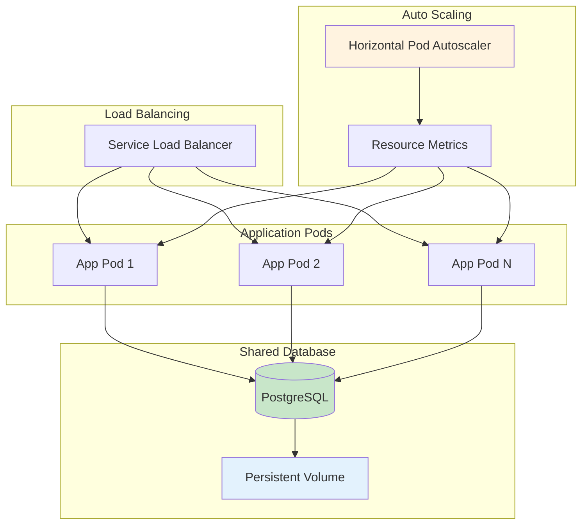

# Step 5: Deploy Demo App V3 (Resource Management & Auto-Scaling)

In this session, you'll deploy Demo App V3, which demonstrates advanced resource management and horizontal pod autoscaling (HPA). This step focuses heavily on `oc` command-line operations and production-ready scaling patterns.

!!! info "Estimated Time"
    **Setup Time:** 20-25 minutes  
    **Testing Time:** 15-20 minutes  
    **Load Testing:** 10-15 minutes

## 🎯 Learning Objectives

By the end of this step, you will:

- ✅ Configure resource requests and limits for production workloads
- ✅ Deploy and configure Horizontal Pod Autoscaler (HPA)
- ✅ Use `oc` commands for advanced application management
- ✅ Generate load to trigger automatic scaling events
- ✅ Monitor resource utilization and scaling behavior

## 📋 Prerequisites

Before starting this step:

- [ ] Completed [Step 4: Deploy Demo App V2](step-4-demo-app-v2.md)
- [ ] PostgreSQL database running from Step 4
- [ ] Comfortable with `oc` CLI commands
- [ ] Understanding of Kubernetes resource concepts

## 🏗️ Demo App V3 Overview

**Demo App V3** focuses on production-ready resource management and scaling:

### Key Features
- 📈 **Aggressive Resource Limits** to trigger scaling quickly
- ⚡ **Horizontal Pod Autoscaler** based on CPU and memory
- 🔧 **Built-in Load Testing** endpoints to generate traffic
- 📊 **Advanced Resource Monitoring** with real-time metrics
- 🎯 **Step 5 Highlighted** in the progress visualization

### Architecture


## 🚀 Step 1: Deploy Demo App V3 with Resource Limits

We'll deploy V3 using `oc` commands with specific resource configurations.

### 1. Create the BuildConfig

```bash
# Create BuildConfig for Demo App V3
oc apply -f - <<EOF
apiVersion: build.openshift.io/v1
kind: BuildConfig
metadata:
  name: demoapp3
  labels:
    app: demoapp3
spec:
  source:
    type: Git
    git:
      uri: https://github.com/cloud-design-dev/tech-lab-demos.git
      ref: main
    contextDir: demo-app-v3
  strategy:
    type: Source
    sourceStrategy:
      from:
        kind: DockerImage
        name: registry.access.redhat.com/ubi8/python-39
      env:
      - name: UPGRADE_PIP_TO_LATEST
        value: "true"
  output:
    to:
      kind: ImageStreamTag
      name: demoapp3:latest
  triggers:
  - type: ConfigChange
  - type: ImageChange
EOF

# Create ImageStream
oc apply -f - <<EOF
apiVersion: image.openshift.io/v1
kind: ImageStream
metadata:
  name: demoapp3
  labels:
    app: demoapp3
spec:
  lookupPolicy:
    local: false
EOF
```

### 2. Start the Build

```bash
# Start the S2I build
oc start-build demoapp3 --follow

# Verify build completion
oc get builds -l buildconfig=demoapp3
```

### 3. Deploy with Resource Limits

```bash
# Create Deployment with aggressive resource limits for scaling demo
oc apply -f - <<EOF
apiVersion: apps/v1
kind: Deployment
metadata:
  name: demoapp3
  labels:
    app: demoapp3
spec:
  replicas: 2
  selector:
    matchLabels:
      app: demoapp3
  template:
    metadata:
      labels:
        app: demoapp3
    spec:
      containers:
      - name: demoapp3
        image: image-registry.openshift-image-registry.svc:5000/$(oc project -q)/demoapp3:latest
        imagePullPolicy: Always
        ports:
        - containerPort: 8080
          protocol: TCP
        env:
        - name: POSTGRES_HOST
          value: postgresql-service
        - name: POSTGRES_PORT
          value: "5432"
        - name: POSTGRES_USER
          value: demo_user
        - name: POSTGRES_PASSWORD
          value: SecurePass123!
        - name: POSTGRES_DB
          value: demo_db
        - name: PORT
          value: "8080"
        resources:
          requests:
            memory: "128Mi"
            cpu: "100m"
          limits:
            memory: "256Mi"
            cpu: "200m"
        livenessProbe:
          httpGet:
            path: /api/health
            port: 8080
          initialDelaySeconds: 30
          periodSeconds: 10
        readinessProbe:
          httpGet:
            path: /api/health
            port: 8080
          initialDelaySeconds: 10
          periodSeconds: 5
EOF
```

### 4. Create Service and Route

```bash
# Create Service
oc apply -f - <<EOF
apiVersion: v1
kind: Service
metadata:
  name: demoapp3-service
  labels:
    app: demoapp3
spec:
  selector:
    app: demoapp3
  ports:
    - name: http
      port: 8080
      targetPort: 8080
  type: ClusterIP
EOF

# Create Route with HTTPS
oc apply -f - <<EOF
apiVersion: route.openshift.io/v1
kind: Route
metadata:
  name: demoapp3
  labels:
    app: demoapp3
spec:
  to:
    kind: Service
    name: demoapp3-service
    weight: 100
  port:
    targetPort: http
  tls:
    termination: edge
    insecureEdgeTerminationPolicy: Redirect
  wildcardPolicy: None
EOF
```

## 📈 Step 2: Configure Horizontal Pod Autoscaler

Now we'll set up HPA to automatically scale based on resource usage.

### 1. Create the HPA

```bash
# Create HPA with CPU and memory targets
oc apply -f - <<EOF
apiVersion: autoscaling/v2
kind: HorizontalPodAutoscaler
metadata:
  name: demoapp3-hpa
  labels:
    app: demoapp3
spec:
  scaleTargetRef:
    apiVersion: apps/v1
    kind: Deployment
    name: demoapp3
  minReplicas: 2
  maxReplicas: 10
  metrics:
  - type: Resource
    resource:
      name: cpu
      target:
        type: Utilization
        averageUtilization: 50
  - type: Resource
    resource:
      name: memory
      target:
        type: Utilization
        averageUtilization: 70
  behavior:
    scaleDown:
      stabilizationWindowSeconds: 300
      policies:
      - type: Percent
        value: 50
        periodSeconds: 60
    scaleUp:
      stabilizationWindowSeconds: 60
      policies:
      - type: Percent
        value: 100
        periodSeconds: 30
      - type: Pods
        value: 2
        periodSeconds: 60
EOF
```

### 2. Verify HPA Configuration

```bash
# Check HPA status
oc get hpa demoapp3-hpa

# Get detailed HPA information
oc describe hpa demoapp3-hpa

# Monitor HPA in real-time (keep this running in a separate terminal)
watch -n 5 'oc get hpa demoapp3-hpa'
```

## 🔍 Step 3: Monitor Initial State

### 1. Check Current Resource Usage

```bash
# View current pod resource usage
oc adm top pods -l app=demoapp3

# Check deployment status
oc get deployment demoapp3

# List all pods
oc get pods -l app=demoapp3 -o wide
```

### 2. Access the Application

```bash
# Get the application URL
APP_URL=$(oc get route demoapp3 -o jsonpath='{.spec.host}')
echo "Demo App V3 URL: https://$APP_URL"

# Test the application
curl -k https://$APP_URL/api/health
```

### 3. Explore V3-Specific Features

Visit the application in your browser and notice:
- **Step 5 highlighted** as current
- **Enhanced resource metrics** showing limits vs usage
- **Load testing controls** for triggering scaling
- **Multiple pod hostnames** if you refresh (load balancing)

## ⚡ Step 4: Load Testing and Scaling

### 1. Generate Load Using Built-in Endpoints

Demo App V3 includes load generation endpoints:

```bash
# Generate CPU load (in separate terminal)
while true; do 
  curl -k -s https://$APP_URL/api/load/cpu/5 > /dev/null
  sleep 1
done

# Generate memory load (in another terminal)  
while true; do
  curl -k -s https://$APP_URL/api/load/memory/50 > /dev/null
  sleep 2
done

# Generate traffic load (in another terminal)
for i in {1..100}; do
  curl -k -s https://$APP_URL/api/persistence/test -X POST \
    -H "Content-Type: application/json" \
    -d '{"data":"Load test entry '$i'"}' &
done
```

### 2. Alternative: Use Apache Bench (if available)

```bash
# High-frequency requests to trigger scaling
ab -n 1000 -c 10 https://$APP_URL/

# Or use hey (if installed)
hey -n 1000 -c 10 https://$APP_URL/
```

### 3. Monitor Scaling in Real-Time

```bash
# Terminal 1: Watch HPA status
watch -n 2 'oc get hpa demoapp3-hpa'

# Terminal 2: Watch pod scaling
watch -n 2 'oc get pods -l app=demoapp3'

# Terminal 3: Monitor resource usage
watch -n 5 'oc adm top pods -l app=demoapp3'

# Terminal 4: Check deployment scaling
watch -n 2 'oc get deployment demoapp3'
```

### 4. Observe Scaling Events

```bash
# View HPA events
oc describe hpa demoapp3-hpa

# View deployment events
oc describe deployment demoapp3

# Check cluster events
oc get events --sort-by=.metadata.creationTimestamp | tail -20
```

## 📊 Step 5: Analyze Scaling Behavior

### 1. Understanding the Scaling Metrics

```bash
# Get current metrics that HPA is using
oc get --raw /apis/metrics.k8s.io/v1beta1/namespaces/$(oc project -q)/pods | jq '.items[] | select(.metadata.labels.app=="demoapp3") | {name: .metadata.name, cpu: .containers[0].usage.cpu, memory: .containers[0].usage.memory}'
```

### 2. Resource Limit Analysis

```bash
# Compare resource requests vs limits vs actual usage
oc describe deployment demoapp3 | grep -A 10 -B 5 "Limits\|Requests"

# Check if pods are being throttled
oc adm top pods -l app=demoapp3 --sort-by=cpu
```

### 3. Scaling History

```bash
# View scaling events over time
oc get events --field-selector involvedObject.name=demoapp3-hpa --sort-by=.metadata.creationTimestamp

# Check HPA conditions
oc get hpa demoapp3-hpa -o yaml | grep -A 20 conditions:
```

## 🎯 Step 6: Advanced Scaling Operations

### 1. Manual Scaling Override

```bash
# Temporarily scale manually (HPA will adjust)
oc scale deployment demoapp3 --replicas=5

# Watch HPA respond to manual changes
oc get hpa demoapp3-hpa -w
```

### 2. Update HPA Configuration

```bash
# Lower CPU threshold to make scaling more aggressive
oc patch hpa demoapp3-hpa -p '{"spec":{"metrics":[{"type":"Resource","resource":{"name":"cpu","target":{"type":"Utilization","averageUtilization":30}}}]}}'

# Reset to original values
oc patch hpa demoapp3-hpa -p '{"spec":{"metrics":[{"type":"Resource","resource":{"name":"cpu","target":{"type":"Utilization","averageUtilization":50}}}]}}'
```

### 3. Scaling Policies Testing

```bash
# Test scale-down behavior by stopping load
# Kill load generation scripts and watch scale-down (takes ~5 minutes)

# View current scaling policies
oc get hpa demoapp3-hpa -o yaml | grep -A 20 behavior:
```

## 🔬 Step 7: Database Performance Under Load

### 1. Check Database Connection Pool

```bash
# Connect to PostgreSQL and check active connections
oc exec -it deployment/postgresql -- psql -U demo_user -d demo_db -c "SELECT count(*) as active_connections FROM pg_stat_activity WHERE state = 'active';"

# Check total connections
oc exec -it deployment/postgresql -- psql -U demo_user -d demo_db -c "SELECT count(*) as total_connections FROM pg_stat_activity;"
```

### 2. Monitor Database Performance

```bash
# Check database resource usage during scaling
oc adm top pods -l app=postgresql

# View database slow queries (if any)
oc exec -it deployment/postgresql -- psql -U demo_user -d demo_db -c "SELECT query, calls, total_time, mean_time FROM pg_stat_statements ORDER BY total_time DESC LIMIT 10;"
```

## ✅ Verification Checklist

You've successfully completed Step 5 when:

- ✅ Demo App V3 is deployed with resource limits
- ✅ HPA is configured and showing current metrics
- ✅ Load testing triggers automatic pod scaling (2 → more pods)
- ✅ Pods scale back down when load decreases (after ~5 minutes)
- ✅ Application shows "Step 5" as highlighted
- ✅ All scaled pods share the same database and show consistent data

## 🎓 Key Concepts Demonstrated

### Resource Management
- **CPU and Memory Limits:** Prevent resource overconsumption
- **Requests vs Limits:** Guaranteed vs maximum resource allocation
- **Resource Utilization:** How HPA makes scaling decisions

### Horizontal Pod Autoscaling
- **Metrics-Based Scaling:** CPU and memory thresholds
- **Scaling Policies:** Control how fast scaling happens
- **Stabilization Windows:** Prevent rapid scaling fluctuations

### Production Patterns
- **Load Balancing:** Traffic distributed across scaled pods
- **Shared State:** Database handles multiple application instances
- **Health Checks:** Ensure only healthy pods receive traffic

## 🔍 Troubleshooting

### HPA Not Scaling

```bash
# Check if metrics-server is available
oc get apiservices | grep metrics

# Verify resource requests are set (required for HPA)
oc describe deployment demoapp3 | grep -A 5 -B 5 "Requests"

# Check HPA conditions
oc describe hpa demoapp3-hpa
```

### Pods Not Getting Load

```bash
# Verify service endpoints
oc get endpoints demoapp3-service

# Test service connectivity
oc exec -it deployment/demoapp3 -- curl localhost:8080/api/health
```

### Resource Limits Too Low

```bash
# Check for OOMKilled or CPU throttling
oc describe pods -l app=demoapp3 | grep -A 5 -B 5 "OOMKilled\|Reason"

# Adjust limits if needed
oc patch deployment demoapp3 -p '{"spec":{"template":{"spec":{"containers":[{"name":"demoapp3","resources":{"limits":{"memory":"512Mi","cpu":"500m"}}}]}}}}'
```

## 📝 What's Next?

You've successfully implemented horizontal pod autoscaling and resource management. Your applications now automatically scale based on load, but there's still one critical production concern: health monitoring.

In **Step 6**, you'll deploy Demo App V4 which focuses on:
- 🏥 **Health Probe Configuration** (liveness, readiness, startup)
- 🔧 **Production Health Monitoring** patterns  
- 🚨 **Self-Healing Container** behaviors
- ✅ **Step 6 Completion Workflow** based on probe configuration

---

**Ready for production health monitoring?** 🚀 [Continue to Step 6: Health Probes →](step-6-demo-app-v4.md)

*Excellent work! You've mastered resource management and autoscaling - critical skills for production OpenShift deployments.* 🎉