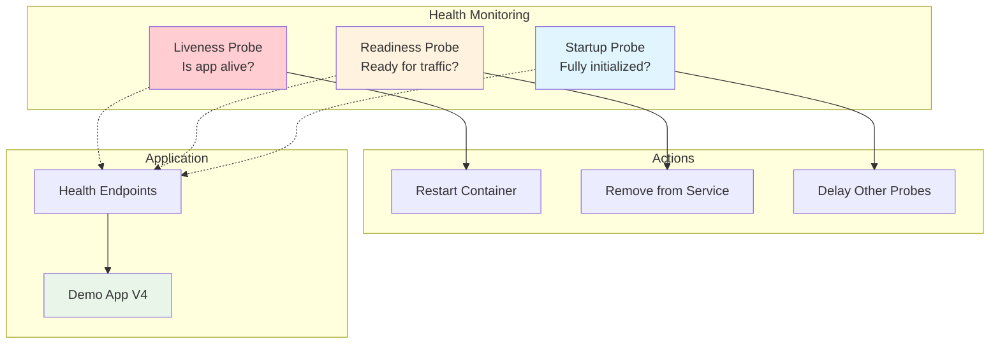

# Step 6: Deploy Demo App V4 (Health Probes & Production Readiness)

In this final lab session, you'll deploy Demo App V4, which demonstrates production-ready health monitoring and self-healing container patterns. This step focuses on health probe configuration and marks the completion of your OpenShift journey.

!!! info "Estimated Time"
    **Setup Time:** 20-25 minutes  
    **Health Configuration:** 15-20 minutes  
    **Testing Time:** 10-15 minutes

## 🎯 Learning Objectives

By the end of this step, you will:

- ✅ Configure liveness, readiness, and startup probes using `oc` commands
- ✅ Understand the difference between probe types and their purposes
- ✅ Implement production health monitoring patterns
- ✅ Test self-healing container behaviors
- ✅ Complete the full OpenShift lab progression (Step 6 completion workflow)

## 📋 Prerequisites

Before starting this step:

- [ ] Completed [Step 5: Deploy Demo App V3](step-5-demo-app-v3.md)
- [ ] PostgreSQL database still running from Step 4
- [ ] Comfortable with advanced `oc` CLI operations
- [ ] Understanding of application lifecycle concepts

## 🏥 Demo App V4 Overview

**Demo App V4** demonstrates production-ready health monitoring:

### Key Features
- 🏥 **Health Probe Detection** - Shows which probes are configured
- 🔧 **Step 6 Workflow** - Automatic completion when all probes are set
- 🚨 **Self-Healing Demonstration** - Container restart behaviors
- 📊 **Production Health Patterns** - Real-world monitoring setup
- ✅ **Lab Completion** - Final step in the learning progression

### Health Probe Types


## 🚀 Step 1: Deploy Demo App V4 (Without Probes)

We'll start by deploying V4 without health probes, then add them progressively.

### 1. Create Build Configuration

```bash
# Create BuildConfig for Demo App V4
oc apply -f - <<EOF
apiVersion: build.openshift.io/v1
kind: BuildConfig
metadata:
  name: demoapp4
  labels:
    app: demoapp4
spec:
  source:
    type: Git
    git:
      uri: https://github.com/cloud-design-dev/tech-lab-demos.git
      ref: main
    contextDir: demo-app-v4
  strategy:
    type: Source
    sourceStrategy:
      from:
        kind: DockerImage
        name: registry.access.redhat.com/ubi8/python-39
      env:
      - name: UPGRADE_PIP_TO_LATEST
        value: "true"
  output:
    to:
      kind: ImageStreamTag
      name: demoapp4:latest
  triggers:
  - type: ConfigChange
  - type: ImageChange
EOF

# Create ImageStream
oc apply -f - <<EOF
apiVersion: image.openshift.io/v1
kind: ImageStream
metadata:
  name: demoapp4
  labels:
    app: demoapp4
spec:
  lookupPolicy:
    local: false
EOF
```

### 2. Build the Application

```bash
# Start the build
oc start-build demoapp4 --follow

# Verify build success
oc get builds -l buildconfig=demoapp4
```

### 3. Deploy Without Health Probes

```bash
# Deploy V4 initially WITHOUT health probes
oc apply -f - <<EOF
apiVersion: apps/v1
kind: Deployment
metadata:
  name: demoapp4
  labels:
    app: demoapp4
spec:
  replicas: 1
  selector:
    matchLabels:
      app: demoapp4
  template:
    metadata:
      labels:
        app: demoapp4
    spec:
      containers:
      - name: demoapp4
        image: image-registry.openshift-image-registry.svc:5000/$(oc project -q)/demoapp4:latest
        imagePullPolicy: Always
        ports:
        - containerPort: 8080
          protocol: TCP
        env:
        - name: POSTGRES_HOST
          value: postgresql-service
        - name: POSTGRES_PORT
          value: "5432"
        - name: POSTGRES_USER
          value: demo_user
        - name: POSTGRES_PASSWORD
          value: SecurePass123!
        - name: POSTGRES_DB
          value: demo_db
        - name: PORT
          value: "8080"
        resources:
          requests:
            memory: "128Mi"
            cpu: "100m"
          limits:
            memory: "512Mi"
            cpu: "500m"
        # NO health probes initially - we'll add them step by step
EOF
```

### 4. Create Service and Route

```bash
# Create Service
oc apply -f - <<EOF
apiVersion: v1
kind: Service
metadata:
  name: demoapp4-service
  labels:
    app: demoapp4
spec:
  selector:
    app: demoapp4
  ports:
    - name: http
      port: 8080
      targetPort: 8080
  type: ClusterIP
EOF

# Create Route
oc apply -f - <<EOF
apiVersion: route.openshift.io/v1
kind: Route
metadata:
  name: demoapp4
  labels:
    app: demoapp4
spec:
  to:
    kind: Service
    name: demoapp4-service
    weight: 100
  port:
    targetPort: http
  tls:
    termination: edge
    insecureEdgeTerminationPolicy: Redirect
  wildcardPolicy: None
EOF
```

## 🔍 Step 2: Verify Initial Deployment and Probe Status

### 1. Check Application Status

```bash
# Verify deployment
oc get deployment demoapp4
oc get pods -l app=demoapp4

# Get application URL
APP_URL=$(oc get route demoapp4 -o jsonpath='{.spec.host}')
echo "Demo App V4 URL: https://$APP_URL"

# Test basic functionality
curl -k https://$APP_URL/api/health
```

### 2. Check Current Probe Configuration

```bash
# Check current deployment configuration (should show NO probes)
oc describe deployment demoapp4 | grep -A 10 -B 10 "Liveness\|Readiness\|Startup"

# This should return empty - no probes configured yet
```

### 3. Access V4 and Notice Missing Probes

Visit the application in your browser and observe:
- **Step 6 is highlighted** but not yet completed
- **Health probe status** shows missing probes
- **Application warns** about missing production health checks

## 🏥 Step 3: Configure Liveness Probe

Liveness probes determine if a container is running properly. If the liveness probe fails, Kubernetes restarts the container.

### 1. Add Liveness Probe

```bash
# Add liveness probe to check if app is alive
oc patch deployment demoapp4 -p '{
  "spec": {
    "template": {
      "spec": {
        "containers": [
          {
            "name": "demoapp4",
            "livenessProbe": {
              "httpGet": {
                "path": "/api/health",
                "port": 8080
              },
              "initialDelaySeconds": 30,
              "periodSeconds": 10,
              "timeoutSeconds": 5,
              "successThreshold": 1,
              "failureThreshold": 3
            }
          }
        ]
      }
    }
  }
}'
```

### 2. Verify Liveness Probe

```bash
# Check that liveness probe was added
oc describe deployment demoapp4 | grep -A 5 "Liveness"

# Wait for rollout to complete
oc rollout status deployment/demoapp4

# Check pod status - should show 1/1 Ready
oc get pods -l app=demoapp4
```

### 3. Test Liveness Probe in Application

Refresh the application in your browser and notice:
- **Liveness probe status** now shows ✅ Configured
- **Application detects** the liveness probe automatically

## 🚦 Step 4: Configure Readiness Probe

Readiness probes determine if a container is ready to receive traffic. If the readiness probe fails, the pod is removed from service endpoints.

### 1. Add Readiness Probe

```bash
# Add readiness probe to check if app is ready for traffic
oc patch deployment demoapp4 -p '{
  "spec": {
    "template": {
      "spec": {
        "containers": [
          {
            "name": "demoapp4",
            "readinessProbe": {
              "httpGet": {
                "path": "/api/health",
                "port": 8080
              },
              "initialDelaySeconds": 5,
              "periodSeconds": 5,
              "timeoutSeconds": 3,
              "successThreshold": 1,
              "failureThreshold": 3
            }
          }
        ]
      }
    }
  }
}'
```

### 2. Verify Readiness Probe

```bash
# Check both probes are configured
oc describe deployment demoapp4 | grep -A 10 "Liveness\|Readiness"

# Wait for rollout
oc rollout status deployment/demoapp4

# Verify pod readiness
oc get pods -l app=demoapp4 -o wide
```

### 3. Check Application Status

Refresh the application and observe:
- **Readiness probe status** now shows ✅ Configured
- **Two of three probes** are now configured

## 🚀 Step 5: Configure Startup Probe

Startup probes are used for slow-starting containers. They disable other probes until the container has finished starting.

### 1. Add Startup Probe

```bash
# Add startup probe for container initialization
oc patch deployment demoapp4 -p '{
  "spec": {
    "template": {
      "spec": {
        "containers": [
          {
            "name": "demoapp4",
            "startupProbe": {
              "httpGet": {
                "path": "/api/health",
                "port": 8080
              },
              "initialDelaySeconds": 10,
              "periodSeconds": 3,
              "timeoutSeconds": 2,
              "successThreshold": 1,
              "failureThreshold": 10
            }
          }
        ]
      }
    }
  }
}'
```

### 2. Verify All Three Probes

```bash
# Check all three probes are configured
oc describe deployment demoapp4 | grep -A 15 "Liveness\|Readiness\|Startup"

# Wait for final rollout
oc rollout status deployment/demoapp4

# Check pod status
oc get pods -l app=demoapp4 -o jsonpath='{.items[*].status.containerStatuses[*].ready}'
```

### 3. Verify Step 6 Completion

Refresh the application and observe:
- **All three probes** now show ✅ Configured
- **Step 6 should automatically complete** with ✅
- **Congratulations message** appears for completing the lab

## 🧪 Step 6: Test Health Probe Behaviors

### 1. Test Readiness Probe Failure

```bash
# Create a temporary endpoint failure to test readiness probe
curl -k -X POST https://$APP_URL/api/health/toggle-readiness

# Watch the pod get removed from service
watch -n 2 'oc get endpoints demoapp4-service'

# After ~15 seconds, restore readiness
curl -k -X POST https://$APP_URL/api/health/toggle-readiness

# Pod should be added back to service
```

### 2. Test Liveness Probe Failure

```bash
# Simulate a liveness failure (this will restart the container)
curl -k -X POST https://$APP_URL/api/health/toggle-liveness

# Watch the container get restarted
watch -n 2 'oc get pods -l app=demoapp4 -o wide'

# Check restart count
oc describe pod -l app=demoapp4 | grep "Restart Count"
```

### 3. Monitor Health Check Events

```bash
# View events related to health check failures
oc get events --field-selector involvedObject.name=$(oc get pod -l app=demoapp4 -o jsonpath='{.items[0].metadata.name}') --sort-by=.metadata.creationTimestamp

# View container logs during health failures
oc logs -l app=demoapp4 --tail=50
```

## 🔧 Step 7: Advanced Health Monitoring

### 1. Custom Health Endpoints

Demo App V4 provides several health-related endpoints:

```bash
# Check detailed health status
curl -k https://$APP_URL/api/health/detailed

# Get probe configuration status
curl -k https://$APP_URL/api/health/probes

# Test database connectivity health
curl -k https://$APP_URL/api/health/database
```

### 2. Health Check Configuration Analysis

```bash
# Export current probe configuration for review
oc get deployment demoapp4 -o yaml | grep -A 20 "livenessProbe\|readinessProbe\|startupProbe"

# Compare with production best practices
cat <<EOF

Production Health Probe Recommendations:
==========================================
Liveness Probe:
  - initialDelaySeconds: 30-60 (depending on startup time)
  - periodSeconds: 10-30 (not too frequent)
  - timeoutSeconds: 5-10
  - failureThreshold: 3-5 (allows for temporary issues)

Readiness Probe:
  - initialDelaySeconds: 5-15 (faster than liveness)
  - periodSeconds: 5-10 (more frequent for traffic routing)
  - timeoutSeconds: 2-5 (quick response needed)
  - failureThreshold: 2-3 (removes from service quickly)

Startup Probe:
  - initialDelaySeconds: 10-30
  - periodSeconds: 2-5 (frequent during startup)
  - failureThreshold: 20-60 (allows for slow startup)
  - Use for applications with long initialization

EOF
```

## 📊 Step 8: Production Health Monitoring

### 1. Scaling with Health Probes

```bash
# Scale to 3 replicas to see health probes in action
oc scale deployment demoapp4 --replicas=3

# Watch all pods become ready with health checks
watch -n 2 'oc get pods -l app=demoapp4 -o wide'

# Verify all pods are in service
oc get endpoints demoapp4-service -o yaml | grep -A 20 "addresses"
```

### 2. Rolling Updates with Health Checks

```bash
# Trigger a rolling update to see health probes during deployment
oc patch deployment demoapp4 -p '{"spec":{"template":{"metadata":{"annotations":{"deployment.kubernetes.io/revision":"rolling-update-test"}}}}}'

# Watch the rolling update with health checks
oc rollout status deployment/demoapp4

# Verify zero-downtime deployment
while true; do curl -k -s https://$APP_URL/api/health | grep -o "healthy" || echo "FAILED"; sleep 1; done
```

## ✅ Step 9: Verify Complete Lab Progression

### 1. Check All Applications

```bash
# List all demo applications
oc get deployments -l 'app in (demoapp1,demoapp2,demoapp3,demoapp4)'

# List all routes
oc get routes -l 'app in (demoapp1,demoapp2,demoapp3,demoapp4)'

# Check resource usage across all apps
oc adm top pods -l 'app in (demoapp1,demoapp2,demoapp3,demoapp4,postgresql)'
```

### 2. Verify Lab Progression

Visit all four applications:

| App | URL | Step Status | Key Feature |
|-----|-----|-------------|-------------|
| V1 | `https://$(oc get route demoapp1 -o jsonpath='{.spec.host}')` | Step 3 ✅ | Ephemeral Storage |
| V2 | `https://$(oc get route demoapp2 -o jsonpath='{.spec.host}')` | Step 4 ✅ | Persistent Storage |
| V3 | `https://$(oc get route demoapp3 -o jsonpath='{.spec.host}')` | Step 5 ✅ | Auto-Scaling |
| V4 | `https://$(oc get route demoapp4 -o jsonpath='{.spec.host}')` | Step 6 ✅ | Health Probes |

### 3. Final Architecture Overview

```bash
# Display complete lab environment
echo "=== OpenShift Demo Lab - Final Architecture ==="
echo "PostgreSQL Database:"
oc get pod -l app=postgresql -o custom-columns=NAME:.metadata.name,STATUS:.status.phase,NODE:.spec.nodeName

echo -e "\nDemo Applications:"
oc get pods -l 'app in (demoapp1,demoapp2,demoapp3,demoapp4)' -o custom-columns=NAME:.metadata.name,APP:.metadata.labels.app,STATUS:.status.phase,RESTARTS:.status.containerStatuses[0].restartCount

echo -e "\nPersistent Storage:"
oc get pvc postgresql-pvc -o custom-columns=NAME:.metadata.name,STATUS:.status.phase,CAPACITY:.status.capacity.storage,STORAGECLASS:.spec.storageClassName

echo -e "\nHealth Monitoring:"
oc describe deployment demoapp4 | grep -A 2 -B 1 "Liveness\|Readiness\|Startup" | grep -v "^--$"
```

## 🎓 Key Concepts Mastered

### Health Probe Types
- **Liveness Probe:** Detects deadlocked or crashed applications → Restart container
- **Readiness Probe:** Determines traffic routing readiness → Remove from service 
- **Startup Probe:** Handles slow-starting applications → Delays other probes

### Production Patterns
- **Self-Healing:** Automatic container restarts on liveness failures
- **Traffic Management:** Readiness probes control service endpoints
- **Zero-Downtime Deployments:** Health checks ensure smooth rolling updates
- **Observability:** Health endpoints provide application status visibility

### OpenShift Operations
- **Progressive Configuration:** Adding probes incrementally with `oc patch`
- **Deployment Monitoring:** Using `oc rollout status` for deployment tracking
- **Event Analysis:** Understanding pod lifecycle through events and logs
- **Resource Management:** Balancing health check frequency with resource usage

## ✅ Final Verification Checklist

🎉 **Congratulations! You've completed the OpenShift Demo Lab when:**

- ✅ Demo App V4 deployed with all three health probe types
- ✅ Step 6 shows as completed in the application interface
- ✅ Health probe behaviors tested (restart, traffic removal)
- ✅ All four demo applications (V1-V4) are running and accessible
- ✅ PostgreSQL database serves V2, V3, and V4 with persistent data
- ✅ Understanding of ephemeral vs persistent storage patterns
- ✅ Experience with resource limits and horizontal autoscaling
- ✅ Knowledge of production health monitoring practices

## 🏆 What You've Accomplished

Through this comprehensive lab, you've gained hands-on experience with:

### **Container Orchestration Fundamentals**
- Source-to-Image (S2I) builds from Git repositories
- Pod lifecycle management and container orchestration
- Service discovery and load balancing across multiple pods
- OpenShift Routes with TLS termination for external access

### **Storage Management**
- Ephemeral storage limitations and use cases
- Persistent Volume Claims and storage classes
- Database integration patterns with PostgreSQL
- Data persistence across pod restarts and scaling operations

### **Resource Management & Scaling**
- CPU and memory requests vs limits configuration
- Horizontal Pod Autoscaler with multiple metrics
- Load testing and scaling behavior analysis
- Production resource optimization strategies

### **Production Readiness**
- Health probe configuration for all probe types
- Self-healing container patterns and restart behaviors
- Zero-downtime rolling deployments
- Monitoring and observability best practices

### **OpenShift CLI Mastery**
- Advanced `oc` commands for application lifecycle management
- Resource inspection and troubleshooting techniques
- Configuration patching and deployment updates
- Event analysis and log investigation

## 🌟 Next Steps

You're now equipped with production-ready OpenShift skills! Consider exploring:

- **Advanced Networking:** Ingress controllers, network policies
- **Security:** RBAC, security contexts, pod security standards  
- **CI/CD Pipelines:** OpenShift Pipelines with Tekton
- **Monitoring Stack:** Prometheus, Grafana, alerting
- **Service Mesh:** Istio integration for microservices
- **GitOps:** ArgoCD for automated deployments

---

**🎉 Congratulations on completing the OpenShift Demo Lab!** 

*You've successfully progressed from basic containerization through production-ready OpenShift deployments. The skills you've learned here apply directly to enterprise container orchestration environments.* ⭐️